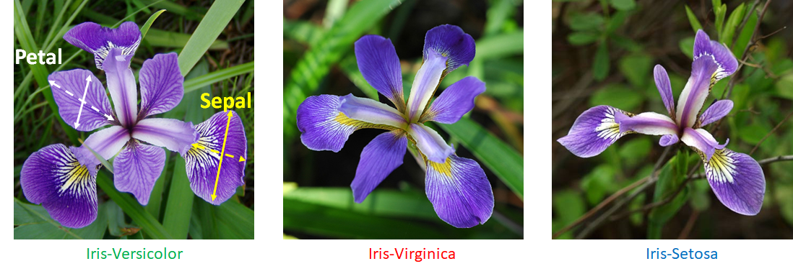
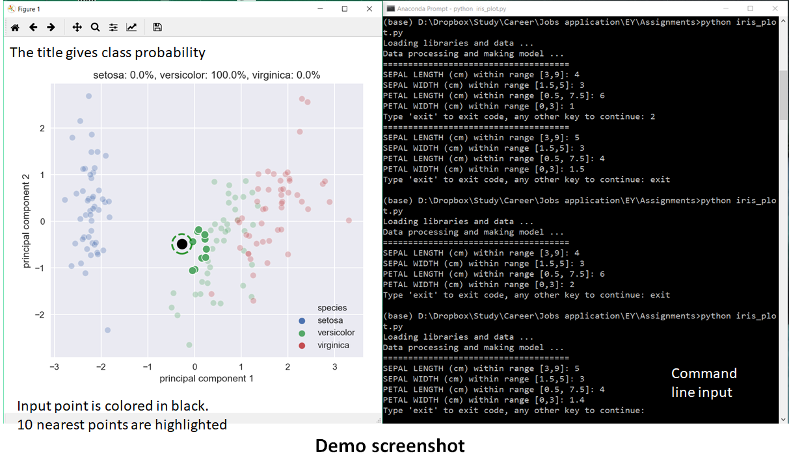

# Iris-flower

This is the code to analyze the [Iris dataset](https://archive.ics.uci.edu/ml/datasets/iris), i.e. predicting the species based on the width and length of the petals and sepals.

<p align="center">
  
</p>

## Details of the files

* [Exploratory Data Analysis.ipynb](https://github.com/dmnguyen92/Iris-flower/blob/master/Exploratory%20Data%20Analysis.ipynb) is the jupyter notebook to explore and visualize the data as well as plotting the prediction
* [iris_plot.py](https://github.com/dmnguyen92/Iris-flower/blob/master/iris_plot.py) is the package for loading models and making predictions
* [utils.py](https://github.com/dmnguyen92/Iris-flower/blob/master/utils.py) contains the utility functions

## How to run the code

```bash
git clone https://github.com/dmnguyen92/Iris-flower.git
pip install -r requirements.txt
python iris_plot.py
```

The code use Python 3.7. All libaries used belong to the standard [Anaconda distribution](https://www.anaconda.com/distribution/).

Displayed result when running ```$ python iris_plot.py```
<p align="center">
  
</p>
